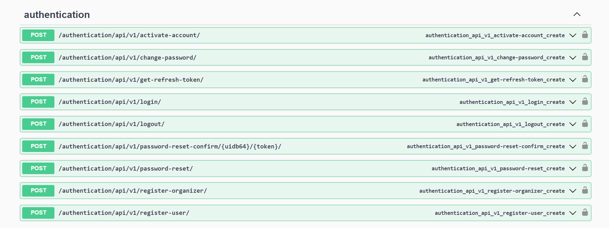
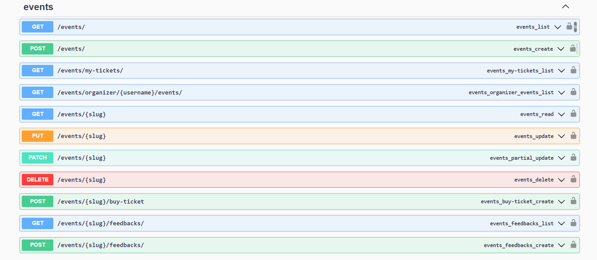

# A Role-Based Event Management App

## Overview

This is a Role-Based Event Management System API built with Django and Django Rest Framework.
The API supports different user roles (Users, Admins, and Organizers), with authentication managed by Simple JWT.
Organizers can create events, and all users can participate in events and post feedback.

## Features

- User and Organizer Registration and Authentication using Simple JWT
- Role-based permissions for event creation and participation
- Event listing with ordering and filtering capabilities
- Real-time notifications using Celery and Redis
- Feedback system for event participants

## Technologies Used

- Django
- Django Rest Framework
- Celery and Redis for task queues and real-time notifications
- PostgreSQL as the database

## Installation

### Prerequisites

- Python 3.7+
- PostgreSQL
- Redis
- Virtualenv (recommended)

### Follow this documentation to install Redis
<a href="https://redis.io/docs/latest/operate/oss_and_stack/install/install-redis/install-redis-on-windows/">https://redis.io/docs/latest/operate/oss_and_stack/install/install-redis/install-redis-on-windows/</a>

### Setup

1. **Clone the repository**
    ```
    git clone https://github.com/arunkumar02042002/event-management-system.git
    cd event-management-system
    ```

2. **Create and activate a virtual environment**
    ```
    virtualenv venv
    source venv/bin/activate
    ```

3. **Add Environments varibales**
    ```
    Create a .env file and set all the variables mentioned in .env-sample
    ```

4. **Install dependencies**
    ```
    pip install -r requirements.txt
    ```

5. **Configure PostgreSQL**

    ```
    Create a PostgreSQL database named 'event_management_db'
    ```

6. **Run migrations**
    ```sh
    python manage.py migrate
    ```

7. **Create a superuser**
    ```sh
    python manage.py createsuperuser
    ```

8. **Configure Redis and Celery**

    Run the redis server
    ```
    redis-server
    ```

    Open another terminal run the following command:
    ```
    $ redis-cli
    127.0.0.1:6379> ping
    PONG
    127.0.0.1:6379>
    ```

    The "PONG" represents success.

9. **Start the Celery worker**
    ```sh
    celery -A core worker -l INFO --pool=solo
    ```

10. **Run Test**
    ```
    python manage.py test
    ```
    Check every test pass and look for errors.

11. **Run the development server**
    ```sh
    python manage.py runserver
    ```
12. **API Docs**
    ```sh
    http://127.0.0.1:8000/swagger
    ```

## Usage

### API Endpoints

- AUTHENTICATION ENDPOINTS



- EVENT ENDPOINTS




- **Registration**
  - `POST authentication/api/v1/register-user/` - Register as a user
  - `POST authentication/api/v1/register-organizer/` - Register as an organizer

- **Events**
  - `GET /events/` - List all events (with ordering and filtering)
  - `POST /events/` - Create an event (Organizers only)
  - `GET /events/<slug>/` - Retrieve an event
  - `PUT /events/<slug>/` - Update an event (Organizers only)
  - `DELETE /events/<slug>/` - Delete an event (Organizers only)

- **Tickets**
  - `POST /events/<slug>/tickets/` - Buy a ticket for an event
  - `GET /events/'my-tickets//` - List all tickets for the logged-in user

- **Feedback**
  - `GET /events/<slug>/feedback/` - List all feedback for an event
  - `POST /events/<slug>/feedback/` - Post feedback for an event (Participants only)

## Event Filtering and Ordering

- **Filtering**:
  - `start_time`: date, gte (greater than or equal), lte (less than or equal), gt, lt
  - `created_at`: date, gte, lte, gt, lt
  - `updated_at`: date, gte, lte, gt, lt

  Example:
  ```
  /events/?start_time__lte=2024-07-01
  /events/?start_time__gte=2024-07-01
  /events/?start_time__date=2024-07-06
  ```

- **Ordering**:
  - `created_at`, `updated_at`, `id`, `start_time`

  Example:
  ```
  /events/?ordering=-created_at
  /events/?ordering=updated_at
  /events/?ordering=id
  /events/?ordering=-start_time
  ```

  **Searching**:
  - `tilte`

  Example:
  ```
  /events/?search=atlas event`
  /events/?search=community`
  /events/?search=event`
  ```

## Notifications

Notifications are sent via email using Celery and Redis for task management. Ensure that your email backend is configured in `settings.py`.


## Contact

For any query: arun.kumar.2403gg@gmail.com

